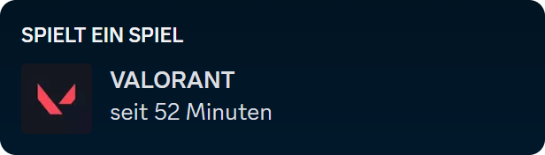
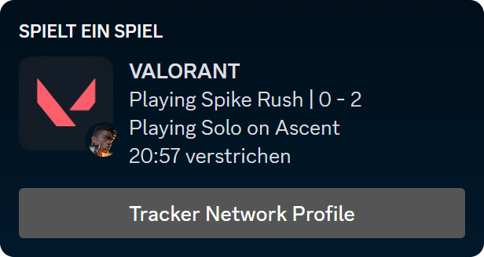

# VALORANT Rich Presence - Enhance Your Discord Experience

> Bring your Discord presence to life with real-time Valorant game status updates. Valorant Discord RPC allows you to
> share your in-game activities with your Discord community.

## Features

- 🎮 **Dynamic Discord Rich Presence**: Automatically display your Valorant game status, including the chosen agent, game
  mode, and current game phase.
- 🏢 **Game Mode Awareness**: Reflect whether you’re in competitive, casual, or spike rush mode.
- 🔄 **Real-Time Status Updates**: Keep your Discord status updated with your progress in real-time.
- 📊 **Match Score Display**: Stay informed with the current score of your match, keeping your community up-to-date with
  your performance.
- 🕵️ **Agent Showcase**: Show off the Valorant agent you're currently playing as.
- 🎉 **Party Size Display**: Indicate how many teammates you’re playing with in your current session.
- ⌛ **Game Phase Indicator**: Let your friends know whether you’re choosing agents, in-game, or waiting for your next
  game.
- 🛠️ **No Configuration Hassle**: Just run the executable, and the app handles everything for you.
- ✅ **User-Friendly**: Enjoy a smooth, straightforward user experience designed for gamers of all levels.
- 📈 **Enhance Viewer Engagement**: Streamers can share their live game status, adding depth to viewer interaction.

## Showcase

  

    <h2>Before</h2>
    
  

  

    <h2>After</h2>
    
    
    
    
    
  

## Getting Started
### Installation

1. Download the latest version of `ValorantRPC.exe` from
   the [Releases](https://github.com/smarterToby/ValorantRPC/releases) page.
2. Run the executable file - no installation necessary.
3. Start Valorant and the application will update your Discord status.

## Usage

Simply run the `ValorantRPC.exe` file to start sharing your game status on Discord.

> The Rich Presence only works if you are visible in the friend list

## Support

Encountered a problem? Have a feature request? Open an issue in
the [Issues](https://github.com/smarterToby/ValorantRPC/issues) section of the repository.

## Contributing

Your contributions are welcome! Please feel free to fork the repository, make your changes, and submit a pull request.

## License

This project is under the MIT License - for more information, see the [LICENSE](LICENSE) file.

## Disclaimer

This project is not endorsed by, directly affiliated with, maintained, authorized, or sponsored by Riot Games, Inc. or
any of its affiliates or subsidiaries. "Valorant" is a trademark, service mark, and/or registered trademark of Riot
Games, Inc. Valorant Discord RPC is an independent project developed by the community for personal use and enhancement
of the gaming experience.
